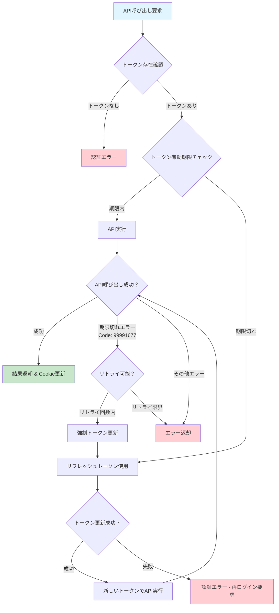

# lark-next-boilerplate

Lark（旧Feishu）認証を統合したNext.js 15アプリケーションのボイラープレートです。

## 🎯 主な機能

- **Lark OAuth認証**: Lark Suite APIを使用したOAuth 2.0認証フロー
- **トークン自動リフレッシュ**: アクセストークンの自動更新機能
- **セキュアなセッション管理**: HTTPOnlyクッキーによる安全な認証状態保持
- **モダンUI**: Tailwind CSS + shadcn/ui による現代的なデザインシステム
- **型安全性**: TypeScript + Zod による厳密な型チェック

## 📋 技術スタック

- **フレームワーク**: Next.js 15 (App Router)
- **言語**: TypeScript
- **認証**: Lark Suite OAuth 2.0
- **スタイリング**: Tailwind CSS
- **UIコンポーネント**: shadcn/ui
- **型検証**: Zod
- **アイコン**: Lucide React

## 🚀 セットアップ手順

### 1. 依存関係のインストール

```bash
npm run lark:init
```

または個別に実行：

```bash
# 依存関係インストール
npm run lark:install

# セットアップスクリプト実行
npm run lark:setup
```

### 2. 環境変数の設定

`.env.local` ファイルを編集して、LarkアプリケーションのCredentialsを設定：

```env
LARK_APP_ID=your_app_id
LARK_APP_SECRET=your_app_secret
NEXT_PUBLIC_LARK_APP_ID=your_app_id
NEXT_PUBLIC_LARK_REDIRECT_URI=http://localhost:3000/api/auth/callback
```

### 3. 開発サーバーの起動

```bash
npm run dev
```

[http://localhost:3000](http://localhost:3000) をブラウザで開いてアプリケーションを確認してください。

## 📁 プロジェクト構造

```
lark-next-boilerplate/
├── src/
│   ├── app/
│   │   ├── api/
│   │   │   ├── auth/callback/       # OAuth コールバックAPI
│   │   │   └── lark/user-info/      # ユーザー情報取得API（自動更新対応）
│   │   ├── lib/
│   │   │   ├── auth.ts              # 認証ヘルパー関数
│   │   │   ├── lark.ts              # 基本Lark SDK設定
│   │   │   └── lark-client.ts       # 自動トークン更新クライアント
│   │   ├── login/                   # ログインページ
│   │   ├── env.ts                   # 環境変数の型安全な管理
│   │   ├── layout.tsx               # ルートレイアウト
│   │   └── page.tsx                 # ホームページ
│   ├── components/
│   │   ├── ui/                      # shadcn/ui コンポーネント
│   │   ├── user/                    # ユーザー関連コンポーネント
│   │   └── login-form.tsx           # ログインフォーム
│   ├── lib/
│   │   ├── lark.ts                  # Lark SDK設定
│   │   └── utils.ts                 # ユーティリティ関数
│   └── types/
│       └── user.ts                  # ユーザー型定義
├── scripts/
│   ├── lark-setup.sh               # セットアップスクリプト
│   └── setup.js                     # Node.jsセットアップスクリプト
├── middleware.ts                    # 認証ミドルウェア
└── components.json                  # shadcn/ui設定
```

## 🔐 認証フロー

1. **ログイン**: ユーザーがLarkでログインボタンをクリック
2. **OAuth認証**: Lark認証サーバーにリダイレクト
3. **コールバック**: 認証成功後、`/api/auth/callback`にリダイレクト
4. **トークン取得**: アクセストークンとリフレッシュトークンを取得
5. **セッション確立**: HTTPOnlyクッキーにトークンを保存
6. **ページアクセス**: 認証済みユーザーとしてアプリケーションにアクセス

## 🔄 自動トークン更新システムフロー



### 🔧 自動更新機能の特徴

- **プロアクティブ更新**: トークン有効期限の1.5時間前に自動更新
- **リアクティブ更新**: API呼び出し時のエラーに基づく自動リトライ
- **最大2回のリトライ**: 失敗時の自動復旧機能
- **シームレスな体験**: ユーザーは再ログインの必要なし

## 🛡️ セキュリティ機能

- **HTTPOnly Cookie**: XSS攻撃からトークンを保護
- **ミドルウェア認証**: 全ページで認証状態をチェック
- **トークンリフレッシュ**: 自動的にアクセストークンを更新
- **型安全な環境変数**: Zodによる環境変数の検証

## 📝 主要なAPIエンドポイント

- `GET /` - ホームページ（認証が必要）
- `GET /login` - ログインページ
- `GET /api/auth/callback` - OAuth認証コールバック
- `GET /api/lark/user-info` - ユーザー情報取得（自動トークン更新対応）

### API使用例

```typescript
// 自動トークン更新機能付きAPI呼び出し
import { autoRefreshLarkClient } from '@/app/lib/lark-client';

const result = await autoRefreshLarkClient.apiCall(async (token) => {
  return await fetch('https://open.larksuite.com/open-apis/contact/v3/users/me', {
    headers: { 
      'Authorization': `Bearer ${token}`,
      'Content-Type': 'application/json'
    }
  });
});
```

## 🎨 UIコンポーネント

このプロジェクトは[shadcn/ui](https://ui.shadcn.com/)を使用しており、以下のコンポーネントが含まれています：

- Button
- Card
- Input
- Label
- Avatar
- Dropdown Menu

## 📦 カスタムスクリプト

- `npm run lark:install` - 依存関係のインストール
- `npm run lark:setup` - セットアップスクリプトの実行
- `npm run lark:init` - 初期セットアップ（install + setup）

## 🔧 開発のヒント

### Larkアプリケーションの設定

1. [Lark Open Platform](https://open.larksuite.com/)でアプリケーションを作成
2. OAuth設定でリダイレクトURLを `http://localhost:3000/api/auth/callback` に設定
3. 必要な権限（ユーザー情報読み取り）を有効化

### 新しいUIコンポーネントの追加

```bash
npx shadcn-ui@latest add [component-name]
```

## 📚 参考資料

- [Next.js Documentation](https://nextjs.org/docs)
- [Lark Open Platform](https://open.larksuite.com/document/)
- [shadcn/ui Documentation](https://ui.shadcn.com/)
- [Tailwind CSS Documentation](https://tailwindcss.com/docs)

## 🐛 トラブルシューティング

### よくある問題

1. **認証エラー**: 環境変数が正しく設定されているか確認
2. **リダイレクトエラー**: Larkアプリ設定のリダイレクトURLを確認
3. **スタイルが反映されない**: Tailwind CSSの設定を確認

## 📄 ライセンス

このプロジェクトはMITライセンスの下で公開されています。
